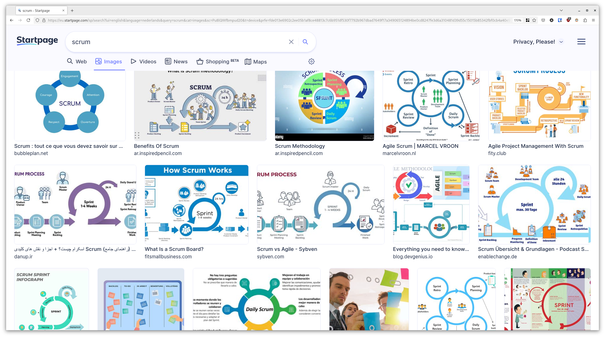
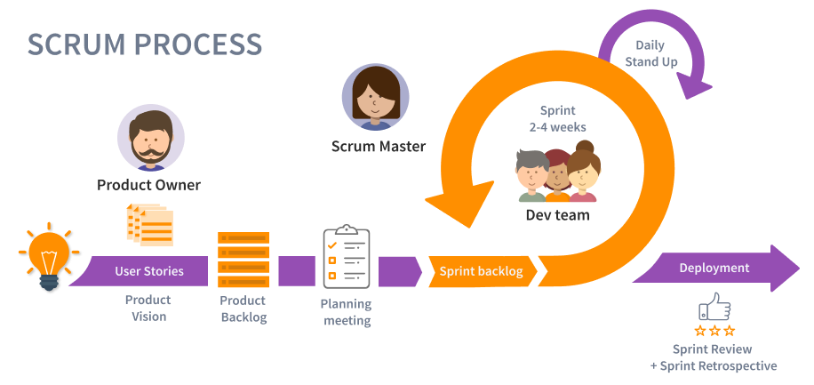
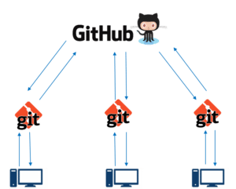

# Kleine start

Project Informatica / Q-highschool / Bijeenkomst 1

---

## Vandaag

- Introductie
- Brainstormen over projectideeën
  - Longlist
  - Shortlist
  - Voorkeuren
- Introductie methodiek en tools

***

## Introductie

---

### Het project

Maak iets! <!-- .element: class="fragment" -->

Wat? Los een probleem op! <!-- .element: class="fragment" -->

Hoe? Gebruik wat je in andere modules hebt geleerd! <!-- .element: class="fragment" -->

---

### Het doel

Aan het eind van de module kun je ...

- vaardigheden uit minstens twee domeinen van de informatica combineren in een product. <!-- .element: class="fragment" -->
- samenwerken volgens de Scrum methode. <!-- .element: class="fragment" -->

---

### Met wie?

In een team van 4 à 5 personen

Met een beetje begeleiding <!-- .element: class="fragment" -->

Notes:
Teams op basis van de onderwerpen die jullie interessant vinden en welke rol je wilt spelen. Kan dus gemixt project 1 en 2, havo/vwo, klas 4 t/m 6, van verschillende scholen.

Begeleiding: docent, projectbegeleider(s), coach

---

### Beoordeling

40%\
eindproduct

Combineer drie domeinen <!-- .element: style="font-size: 0.8em" -->

60%\
jouw bijdrage en inzet

Via observaties, eigen reflectie en commentaar van je team <!-- .element: style="font-size: 0.8em" -->

---

### Planning

{{ planning_tabel }}
<!-- .element: class="planning" -->

---

### Syllabus

[informatica.q-highschool.nl/project](../)

---

### Afspraak

Als je niet bij een bijeenkomst kunt zijn, dan ...

1. Meld je je af bij de docent <!-- .element: class="fragment" -->
2. Meld je je af bij je team <!-- .element: class="fragment" -->
3. Zorg je dat jouw taken gedaan worden <!-- .element: class="fragment" -->

Notes:
Als je taken hebt die in die bijeenkomst gedaan moeten worden, dan zorg je dat iemand anders dat overneemt. Anders zorg je dat je die taak op een ander moment uitvoert (maar let erop dat je team daar niet op hoeft te wachten!).

***

## Brainstorm

---

### Wat wil je maken?   Brainstormsessie - 15 min

1. Leer elkaar kennen:
   - Wat heb je altijd al willen maken?
   - Wat zijn jouw hobby's, interesses, behoeften?
   - Welke modules heb je al gevolgd?
   - Wat kun je bijdragen aan een project?
2. Brainstorm: wat is voor deze groep een interessant project?
   - Geen idee is te gek!
3. Stuur de beste ideeën in via\
   <{{ form_ideeen }}>

<!-- .element: style="font-size: .8em" -->

Notes:
Zet je camera en geluid aan.

Dit is niet per se de groep waarmee je gaat samenwerken, het gaat erom dat we ideeën verzamelen! Ook als er maar twee mensen in een groep zitten die een idee leuk vinden, stuur het in!

Dit wordt een longlist, straks maken we daar een shortlist van met de beste ideeën.

***

## Longlist &rarr; Shortlist

***

## Methodiek

---

 <!-- .element: style="max-width: 100%; max-height: 100%" -->

---

 <!-- .element: style="max-width: 100%; max-height: 100% -->

Bron: <https://www.tuleap.org/agile/agile-scrum-in-10-minutes> 

<!-- .element: style="font-size: 0.3em; position: fixed; left: 0; bottom: 0;" -->

---

### Rollen in het team

---

#### Scrum master

Houdt van overzicht en houdt het overzicht <!-- .element: class="fragment" -->

Heerser van de takenlijst <!-- .element: class="fragment" -->

Spin in het web der samenwerking <!-- .element: class="fragment" -->

---

#### Product owner

Leidt de groep naar het eindproduct <!-- .element: class="fragment" -->

Houdt in de gaten of de taken leiden naar het eindproduct <!-- .element: class="fragment" -->

Verantwoordelijk voor presentaties en communicatie "naar buiten" <!-- .element: class="fragment" -->

---

#### Developer

Maakt het product <!-- .element: class="fragment" -->

---

### Rollen in het team

Lees de beschrijvingen in de [syllabus](../rollen.html).

Notes:
Bedenk welke rol je wilt hebben. Waar liggen jouw kwaliteiten? Wat zou je juist willen leren?

Evt in de Teams chat:

Welke rol heeft op dit moment jouw voorkeur?\
👍️ Scrum master\
❤️ Product owner\
😄 Developer

***

## Tools

Trello en GitHub <!-- .element: class="fragment" -->

---

### Trello

Een service om taken bij te houden\
op een "Kanban bord"

Notes:
Demo met een "echt" bord.

---

### GitHub

Een service om bestanden te delen met Git

Bron afbeelding: <https://www.edureka.co/blog/how-to-use-github/> 

<!-- .element: style="font-size: 0.3em; position: fixed; left: 0; bottom: 0;" -->

Notes:
Waarom Git? Iedereen een eigen kopie, zodat je programma kunt testen terwijl anderen er ook aan werken.

---

### Workshops

[Workshop: Trello](../workshop_trello.html) en\
[Workshop: Git en GitHub](../workshop_github.html)\
in de syllabus

&nbsp;

<small>Doe die voor volgende week!</small>

Notes:
Voor project 1 verplicht, voor project 2 vrijwillige opfrisser.

***

## Shortlist &rarr; Voorkeuren

***

## "Huiswerk"

<small style="margin-top: -0.5em;">voor volgende week</small>

1. Bedenk welke rol jij het liefste wilt hebben\
   <small>zie de beschrijvingen in de [syllabus](../rollen.html)</small>
2. Geef jouw voorkeur door voor project en rol\
   <small>(zie Teams)</small>
3. Doe de workshops over [Trello](../workshop_trello.html) en [GitHub](../workshop_github.html)\
   <small>Verwachte tijdsinvestering: &plusmn; 1 uur</small>

---

## Volgende week

Fysieke les, van 14:30 tot 17:00

Neem mee:\
opgeladen laptop met oplader\
goeie zin