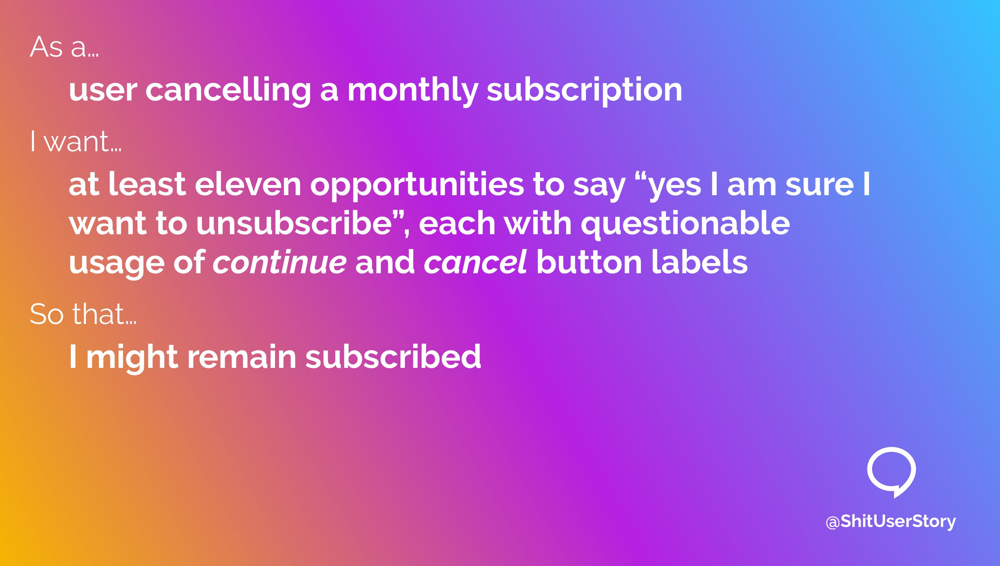
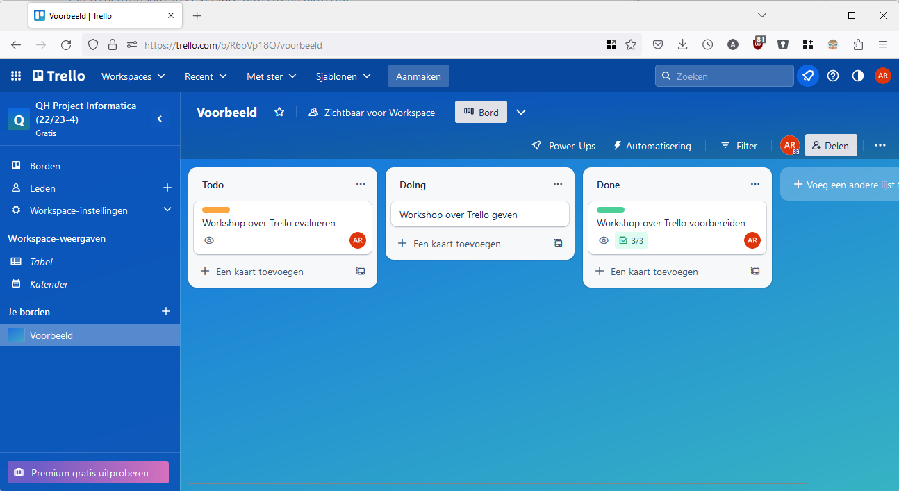

# Grote start

Project Informatica / Q-highschool / Bijeenkomst 2

---

## Vandaag

- Aan de slag met methodiek
  - User stories en productvisie
  - Rollen en samenwerking
  - Trello en GitHub
- Kennismaking
- Organisatorische afspraken
- Bekendmaking project teams
- Aan de slag
- Beoordeling

***

## Methodiek

---

 <!-- .element: style="max-width: 100%; max-height: 100% -->

Bron: <https://www.tuleap.org/agile/agile-scrum-in-10-minutes> 

<!-- .element: style="font-size: 0.3em; position: absolute; left: 0; bottom: 0;" -->

---

<!-- .slide: data-auto-animate -->

### User stories

**Als** zorgverlener,\
**wil ik** inzicht in de medicatiehistorie van de patiënt,\
**zodat** ik bij twijfel de nieuw voorgeschreven dosering gemakkelijk van verifiëren.

Bron: <https://agilescrumgroup.nl/wat-is-een-user-story/>

<!-- .element: style="font-size: 0.3em; position: absolute; left: 0; bottom: 0;" -->

---

<!-- .slide: data-auto-animate -->

### User stories

 <!-- .element: style="max-width: 100%; max-height: 100% -->

Bron: <https://twitter.com/ShitUserStory/status/1630596868257267713>

<!-- .element: style="font-size: 0.3em; position: absolute; left: 0; bottom: 0;" -->

---

### Productvisie

Waar willen jullie met het project naartoe?

- visie (wat wil je bereiken?)
- doelgroep (voor wie?)
- behoefte (wat heeft die doelgroep nodig?)
- product (wat wordt het product?)
- doelen (wat is de waarde van het product?)

Notes:
Doel is om alle neuzen dezelfde kant op te krijgen

---

Als team bespreek je de globale richting van het product

### Product owner

De product owner werkt de productvisie en user stories uit

---

 <!-- .element: style="max-width: 100%; max-height: 100% -->

Bron: <https://www.tuleap.org/agile/agile-scrum-in-10-minutes> 

<!-- .element: style="font-size: 0.3em; position: absolute; left: 0; bottom: 0;" -->

---

### Scrum master

Richt een backlog in,\
leidt de weekly standup, en\
let erop dat taken verdeeld en op tijd gedaan worden

Notes:
Hierna: genoeg gekletst, tijd om in actie te komen &rarr; coach

***

## Tools: Trello

---

 <!-- .element: style="max-width: 100%; max-height: 100% -->

---

<!-- .slide: data-auto-animate -->

### Wat zijn goede taken?

Een afgebakend onderdeel van het product <!-- .element: class="fragment" -->

Door één persoon met wat voorkennis binnen enkele uren uit te voeren <!-- .element: class="fragment" -->

---

<!-- .slide: data-auto-animate -->

### Wat zijn goede taken?

**Geen goede taken**

- De website maken.
- App met informatie bouwen.
- Database ontwerpen

*Iedere taak voor meer dan twee personen.*

**Goede taken**

- De tekst voor de 'Over ons' pagina op de website schrijven.
- De navigatie op de website bouwen.
- De 'gebruikers' tabel in de database ontwerpen.

---

### Aan de slag

In groepen van 3-4 (niet de uiteindelijke projectgroep)

[*Aan de slag met Trello*   informatica.q-highschool.nl/project](https://informatica.q-highschool.nl/project/2425-3/workshop_trello.html)

Notes:
ca. 10 minuten, daarna bespreken welke taken ze bedacht hebben (en of die goed zijn)

***

## Tools: GitHub

---

### Aan de slag

Werk in tweetallen

[*Werken met GitHub*   informatica.q-highschool.nl/project](https://informatica.q-highschool.nl/project/2425-3/howto_github.html)

***

## Afspraken

---

### Eindoplevering

op woensdag 19 maart 14:30 - 16:00

Save the date!

---

### Bij afwezigheid

Als je niet bij een bijeenkomst kunt zijn, dan ...

1. Meld je je af bij de docent <!-- .element: class="fragment" -->
2. Meld je je af bij je team <!-- .element: class="fragment" -->
3. Zorg je dat jouw taken gedaan worden <!-- .element: class="fragment" -->

Notes:

Als je taken hebt die in die bijeenkomst gedaan moeten worden, dan zorg je dat iemand anders dat overneemt. Anders zorg je dat je die taak op een ander moment uitvoert (maar let erop dat je team daar niet op hoeft te wachten!). 

Tip: spreek af wie de vice-scrum master is.

---

### Communicatiemiddelen

Gebruik hoofdzakelijk **Teams** voor de communicatie

Zet meldingen aan!

Notes:
Dan kunnen wij een beetje meekijken wat er zoal gebeurt, en kun je makkelijk vragen stellen door een van ons te mentionen.

***

## De teams

***

## Aan de slag

[*Startopdracht*   informatica.q-highschool.nl/project](https://informatica.q-highschool.nl/project/2425-3/startopdracht.html) <!-- .element: class="fragment" -->

***

## Beoordeling

[*Beoordeling*   informatica.q-highschool.nl/project](https://informatica.q-highschool.nl/project/2425-3/beoordeling.html) <!-- .element: class="fragment" -->

---

### Rank yourself!

<https://forms.office.com/e/bZD7f799bR>

<!-- .element: class="r-stretch" -->

***

## Volgende week

Online, weekly standup

Spreek met je team af hoe je gaat samenwerken!
