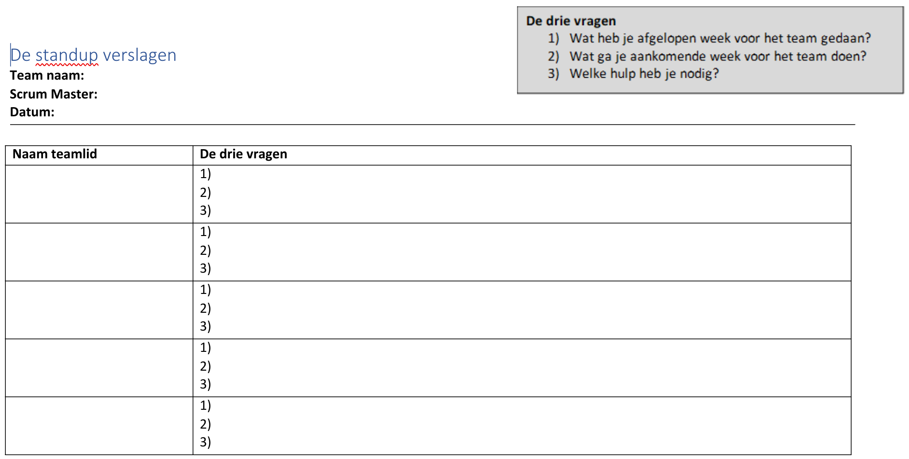

# Weekly Standup 1

<!-- .element: style="font-size: 2.4em" -->

Project Informatica / Q-Vakken/ Bijeenkomst 2

---

## Vandaag

- Huishoudelijke mededelingen
- Uitleg weekly standup
- Weekly standups

***

## Huishoudelijke mededelingen

<!-- .element: style="font-size: 1.3em" -->

Als je niet bij een bijeenkomst kunt zijn, dan ...

1. Meld je je af bij de docent
2. Meld je je af bij je team
3. Meld je je af bij de Q-vak app
4. Zorg je dat jouw taken gedaan worden

Notes:

Als je taken hebt die in die bijeenkomst gedaan moeten worden, dan zorg je dat iemand anders dat overneemt. Anders zorg je dat je die taak op een ander moment uitvoert (maar let erop dat je team daar niet op hoeft te wachten!). 

Tip: spreek af wie de vice-scrum master is.

---

## Huishoudelijke mededelingen

<!-- .element: style="font-size: 1.3em" -->

Zorg voor een goed communicatiekanaal!

Teams is handig om ons te bereiken, maar zorg ook dat je elkaar kunt bereiken.

---

## Huishoudelijke mededelingen

<!-- .element: style="font-size: 1.3em" -->

Mag je kopiëren van het internet?\
*Jein.*

Alleen als je de bron vermeldt, en\
alleen als de bron het toestaat!

Geldt voor code, afbeeldingen, muziek etc.

We beoordelen de toegevoegde waarde

***

<!-- .slide: data-auto-animate style="font-size: .8em" -->

## Weekly standup

- Wekelijkse meeting met je team:
  - om de voortgang te bespreken,
  - geleid door de Scrum Master.
- Iedereen komt aan de beurt, met drie vragen per persoon:
  - Wat heb je vorige week voor het team gedaan?
  - Wat ga je aankomende week voor het team doen?
  - Welke hulp heb je nodig?

Doe de weekly standup als een begeleider aanschuift.\
Zet je Trello bord in beeld!

Notes:
Wees gedetailleerd: niet “ik ga aan de tekeningen werken” maar “ik ga de hoofdpersoon tekenen en die vis aanpassen, want de kleur past totaal niet bij de achtergrond.”

---

<!-- .slide: data-auto-animate style="font-size: .8em" -->

## Weekly standup

- Iedereen komt aan de beurt, met drie vragen per persoon:
  - Wat heb je vorige week voor het team gedaan?
  - Wat ga je aankomende week voor het team doen?
  - Welke hulp heb je nodig?

*Scrum master* stelt de vragen,\
houdt de planning in de gaten,\
organiseert de hulp,\
houdt het standup verslag bij, en\
zorgt dat ook afwezigen op de hoogte zijn.

Notes:
En als er mensen afwezig zijn, dan zorg je dat je voor de standup hun antwoorden op de vragen hebt, zodat je dat tijdens de standup kunt bespreken.

---

### Standup verslag

<!-- .element: class="r-stretch" -->

Notes:
Voornamelijk voor jezelf, zodat je kunt teruglezen wat er afgesproken is en wat er in voorgaande weken gedaan is.

---

## Weekly standup

Meeting in jullie eigen Teamskanaal

Doe de weekly standup als een begeleider aanschuift

Notes:
Uiteraard zet je dan je camera aan en heb je werkend geluid. Gebruik evt je telefoon.

***

<!-- .slide: style="text-align: left" -->

## Opstartzaken

- Wat ga je maken in een/twee zinnen?
- Trello bord (met een uitnodigingslink)

☝️ Zet dit in een bericht in je Teamskanaal

<!-- .element: style="padding-left: 2em;" -->

- GitHub repository
- Productvisie

***

## Vandaag

<table class="standup_planning">
  <thead>
    <tr><td></td><td><s>Pieter</s></td><td>Els & Niek</td></tr>
  </thead>
  <tbody>
    <tr><td>15:00 - 15:20</td><td colspan="2">001 Mimi</td></tr>
    <tr><td>15:25 - 15:45</td><td colspan="2">002 Team Olympus</td></tr>
    <tr><td>15:50 - 16:10</td><td colspan="2">004 Team Slop</td></tr>
    <tr><td>16:15 - 16:35</td><td colspan="2">003 Cube Engineers</td></tr>
    <tr><td>16:40 - 17:00</td><td colspan="2">005 Team TestTypSnelheidTeam</td></tr>
    <tr><td>17:05 - 17:25</td><td colspan="2">006 Bulldozers</td></tr>
  </tbody>
  <tfoot>
    <tr><td>16:50</td><td colspan="2">Afsluiting</td></tr>
  </tfoot>
</table>

***

## Beoordelingscriteria

Kies er drie voor je projectproduct

---

<!-- .slide: data-background-iframe="https://directpoll.com/r?XDbzPBd3ixYqg8zN1dN9OtvtmpOJeG0IBuhw5dpdBb8fPjO" data-background-interactive="true" -->

---

## Volgende week

Online bijeenkomst

Weekly standup