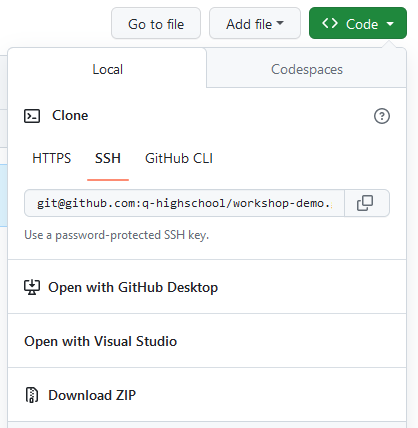
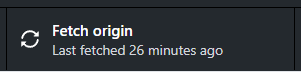
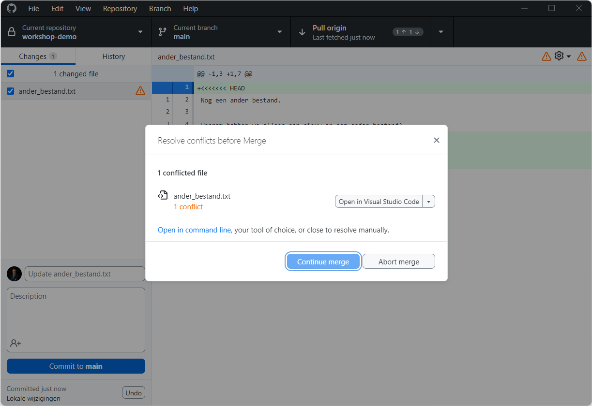
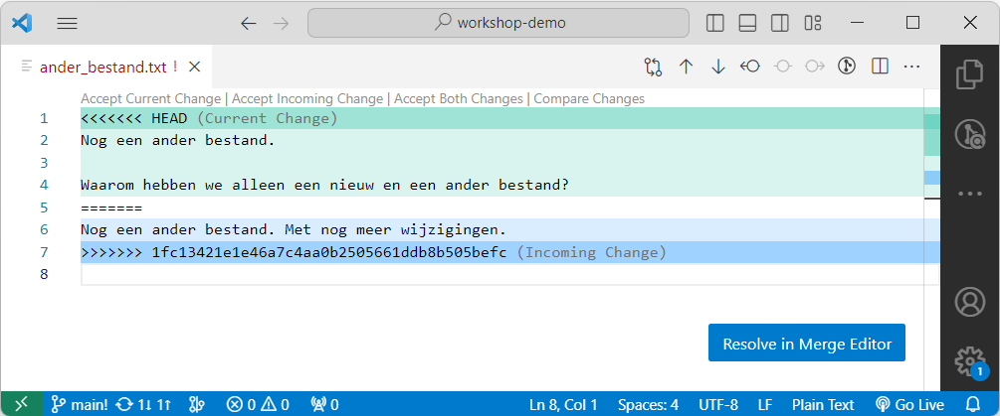

# Werken met GitHub

Als je via [GitHub Classroom](startopdracht.md#bijlage-een-github-classroom-team-aanmaken) een team hebt aangemaakt of je bij een team hebt aangesloten, kom je uiteindelijk op een pagina zoals deze:

Dit is de hoofdpagina van jullie *repository*. Dat is de naam die in Git gebruikt wordt voor een map die je deelt met teamgenoten en waarvan de geschiedenis wordt bijgehouden. Om aan de code te werken, is het handig om die op je eigen laptop te hebben. Daarvoor maken we gebruik van [GitHub Desktop](https://desktop.github.com), dus installeer dat als je dat nog niet gedaan had.

:::{note}

Ben je al bekend met Git of GitHub? Gebruik je graag de command line of de Git-integratie in je favoriete editor of IDE? Allemaal prima, dat werkt gewoon, ook als je teamgenoten de uitleg volgen die hier gegeven is.

:::

Om je repository te openen in GitHub Desktop, klik je op de website op de groene knop  en vervolgens kies je de optie *Open with GitHub Desktop*:

GitHub Desktop wordt dan geopend en het volgende venster verschijnt:

In het eerste veld staat de URL van de repository, dus daar hoef je niets mee te doen. In het tweede veld staat de map op jouw computer waar de bestanden uit de repository opgeslagen zullen worden. Je kunt de standaard plek laten staan, of een andere locatie kiezen met knop *Choose*. Onthoud in elk geval waar je bestanden terecht komen! Klik op de knop *Clone* om de repository naar jouw computer te kopiëren. Als dat klaar is, verschijnt het volgende venster:

## Jouw wijzigingen delen

Als je wijzigingen in je bestanden hebt gemaakt en je komt terug in GitHub Desktop, dan zie je in de linkerbalk de lijst van bestanden waar wijzigingen in zijn: met een geel bolletje betekent een bewerkt bestand, een groen plusje duidt op een nieuw bestand en een rood minnetje is een verwijderd bestand. Door op die bestanden te klikken, zie je aan de rechterkant de wijzigingen in dat bestand.

Om die wijzigingen te delen met je teamgenoten, geef je bij *Summary* een korte beschrijving van je wijzigingen. Als je vervolgens op de knop *Commit to main* klikt, worden je wijzigingen opgeslagen in Git. Je wijzigingen zijn nog niet gedeeld met je teamgenoten, maar je kunt deze versie van je project nu wel altijd terugvinden.

GitHub Desktop vertelt je nu dat er geen lokale wijzigingen meer zijn (dus geen wijzigingen die je nog niet aan Git hebt toegevoegd). De fetch/push/pull knop is veranderd in *Push origin*, met een 1 en een pijltje omhoog ernaast. Dat betekent dat je één commit op je computer hebt, die je nog niet naar GitHub hebt gestuurd. Als je op die knop klikt, stuur je jouw wijzigingen naar GitHub en kunnen je teamgenoten ze daar ook vinden.

## Wijzigingen van teamgenoten ophalen

Als je wilt kijken of één van je teamgenoten wijzigingen naar GitHub heeft gestuurd, dan klik je op de *Fetch origin* knop. Daarmee worden wijzigingen die op GitHub staan opgehaald, maar nog niet toegepast op de bestanden die op jouw computer staan.

Als er wijzigingen beschikbaar zijn, dan verandert de knop daarna in een *Pull origin* knop. Je ziet aan de rechterkant een 1 met een pijltje naar beneden staan. Dat betekent dat er één commit op GitHub beschikbaar is met wijzigingen die nog niet op jouw computer staan. Als je op deze knop klikt, dan worden die wijzigingen opgehaald en toegepast op de bestanden op jouw computer.

Let op: je kunt alleen wijzigingen ophalen als er geen lokale wijzigingen zijn die je nog niet aan Git hebt toegevoegd (dus in GitHub Desktop moet groot "No local changes" zichtbaar zijn). Als je met lokale wijzigingen toch op *Pull origin* klikt, krijg je deze foutmelding:

De beste oplossing is om hier op *Close* te klikken en je werk te committen en pas daarna te pullen. Je kunt ook gebruik maken van de *stash*, maar daar gaan we hier niet op in.

## Geschiedenis bekijken

Het mooie van Git is ook dat je alle oude versies van het project terug kunt vinden. Klik daarvoor op de knop *History* bovenin de balk aan de linkerkant:

Om terug te gaan naar het standaard venster, klik je op de knop *Changes*.

## Wijzigingen tegelijkertijd

Het kan natuurlijk gebeuren dat meerdere personen tegelijkertijd wijzigingen maken. Als je een of meerdere lokale commits hebt en iemand anders heeft al op GitHub commits gemaakt, dan ziet de *Pull origin* knop er zo uit:

In dit geval staat er een 1 met een pijltje omhoog voor de commit die je zelf gemaakt hebt en naar GitHub wilt sturen en een 1 met een pijltje naar beneden met een commit die op GitHub staat die je kunt ophalen. Over het algemeen kun je nu op gewoon op deze knop klikken en worden de wijzigingen automatisch samengevoegd. Als de wijzigingen in verschillende bestanden zitten, dan gaat dat sowieso goed en als de wijzigingen in verschillende delen van een bestand zitten vaak ook. In dat geval kom je gewoon op het scherm "No local changes" uit.

Als jullie tegelijkertijd wijzigingen hebben gemaakt op dezelfde plek in een bestand, dan krijg je een melding als deze:

De knop die daarnaast staat hangt af van de programma's die je geïnstalleerd hebt. Als je [Visual Studio Code](https://code.visualstudio.com) geïnstalleerd hebt, dan zie je die hier staan. Je kunt ook op het pijltje ernaast klikken en een ander programma kiezen. In principe werkt dit in alle programma's vergelijkbaar, maar hier laten we het zien met Visual Studio Code. Als je een bestand met een conflict opent, dan zie je een aantal bijzondere regels:

De regel `<<<<<<< HEAD` is het begin van het stuk code dat je lokaal op jouw computer hebt. VS Code geeft dat extra aan met `(Current Change)`: dit is de huidige wijziging die jij gemaakt hebt. Tussen de twee versies staat `=======` als scheiding. De regel `>>>>>>> 1fc13421e1e46a7c4aa0b2505661ddb8b505befc` geeft het einde van de conflicterende wijziging aan. De code die hier staat is de unieke id die Git aan de commit heeft gegeven. VS Code geeft dit aan met `(Incoming Change)`: dit is de wijziging die binnenkomt vanuit GitHub.

Je kunt er nu voor kiezen om jouw wijzigingen te behouden, de inkomende wijziging te accepteren, ze beide te behouden of ze handmatig samen te voegen. In VS Code staan daar knoppen voor, maar in elk programma kun je gewoon handmatig de tekst aanpassen zodat het een logisch resultaat is. Als uiteindelijk de `<<<<<<<`, `=======` en `>>>>>>>` regels allemaal weg zijn, dan is Git tevreden en kun je de merge voltooien in GitHub Desktop. In dit geval is het logisch om de twee wijzigingen samen te voegen:

In GitHub Desktop staat nu dat het conflict is opgelost:

Met een klik op *Continue merge* wordt er nu een nieuwe commit aangemaakt met jouw samenvoeging. Bij de *Push origin* staat nu een pijltje omhoog met een 2 ervoor: we hebben de commit die we konden ophalen opgehaald en samengevoegd met onze wijziging in een nieuwe commit, dus nu kunnen we onze originele commit en de samenvoeging naar GitHub pushen met een druk op deze knop.

