# Startopdracht

Nu gaan we echt beginnen! Volg deze stappen om samen met je team goed van start te gaan met je project. De **scrum master** heeft vanaf nu de leiding bij alle meetings met het hele team en is er dus verantwoordelijk voor dat alle stappen worden doorlopen.

## 1. Kennis maken

Neem minstens 10 minuten de tijd om kennis te maken. Leer elkaar kennen, probeer om het de komende 10 minuten nog niet over het project te hebben. Welke andere modules hebben jullie al gedaan? Welke ervaring breng je mee? Zijn er gedeelde hobbies of interesses?

## 2. Teamnaam

Verzin een naam voor je team. Geef de naam door aan je docent, zodat die een Teamskanaal aan kan maken.

## 3. Werkafspraken

Maak werkafspraken:

- Wanneer werken jullie live met elkaar samen?
- Hoe wordt er gecommuniceerd? Via Teams, e-mail, Signal, WhatsApp, Discord of via de post?
- Wat doe je als je een taak niet op de afgesproken tijd af kunt krijgen?
- Mag je gebruik maken van generatieve AI-tools? Zo ja, onder welke voorwaarden?
- ...

**Schrijf deze afspraken op** en zet ze in jullie Teamskanaal, zodat de scrum master jullie eraan kan houden.

## 4. Trello en GitHub

Maak je Trello bord en GitHub repository aan.

De **scrum master** volgt de stappen in {ref}`trello-aanmaken` en deelt de *uitnodigingslink* naar je Trello *Workspace* in jullie Teamskanaal. De **andere teamleden** volgen de stappen in {ref}`trello-deelnemen`.

*Een van de* **developers** maakt in GitHub Classroom een team en een repository aan volgens de stappen in {ref}`github-aanmaken`. De **andere teamleden** volgen de stappen in {ref}`github-deelnemen`. De link naar de GitHub Classroom opdracht vind je daar.

## 5. Brainstorm

Brainstorm samen, met je hele team, over de richting van het product. Wat gaan jullie maken? Het doel is om overeenstemming te krijgen over wat je gaat maken. Het doel is hier nog niet om een uitgewerkt voorstel te hebben, maar om een duidelijk genoeg beeld te hebben waarmee de product owner aan een productvisie kan beginnen en de developers kunnen starten met het maken van technologische keuzes. De scrum master vat samen wat er besloten is. Besteed aan deze stap **maximaal 30 minuten**.

## 6. Aan de slag

Als de richting helder is, dan kunnen jullie opsplitsen en je focussen op de taken die bij je rol horen.

### Product owner

Ga aan de slag met de productvisie. Idealiter heb je aan het einde van de bijeenkomst een goede eerste opzet om met je team te bespreken.

1. Lees deze pagina over de productvisie: <https://agilescrumgroup.nl/productvisie/>
2. Werk de eerste vijf punten van de productvisie uit zoals beschreven op de link hierboven. De punten over geld hoef je niet te noemen, maar de eerste vijf zijn wel belangrijk. Punt 6 en 8 zijn ook leuk, als je daar over na wilt denken.
3. Schrijf minstens 4 user stories.

Zet de productvisie en user stories in jouw map in jullie Teamskanaal (kijk bij *Bestanden > 2 Product Owner*) en laat je team weten wanneer je dit gedaan hebt, zodat zij er ook naar kunnen kijken.

### Developers

Bepaal welke technologie jullie gaan gebruiken om het product te realiseren. Idealiter heb je aan het einde van de bijeenkomst hier duidelijke afspraken over en weet je ook waar je je eventueel nog in moet verdiepen.

Dus: welke game engine ga je gebruiken voor een game? (Tip: [Godot](https://godotengine.org/) is over het algemeen populair, maar bedenk ook of je wel de tijd wilt nemen om een nieuwe engine te leren. [Arcade](https://api.arcade.academy/en/stable/) is een goede optie in Python.) Ga je een app schrijven in Android Studio, of wordt het App Inventor? Of een iOS app? Welke database ga je gebruiken, en hoe kun je die installeren? Ga je Python gebruiken om je programma in te bouwen, of wordt het deze keer JavaScript of Processing (of nog iets anders)? 

Begin vervolgens met het installeren en opzetten van de ontwikkelomgevingen. Vergeet ook niet om de juiste *.gitignore* instellingen in je Git repository toe te voegen, voordat je begint met het aanmaken van de projectbestanden. Zet ook meteen in de *README.md* welke tools je nodig hebt om het project uit te voeren en welke stappen je daarvoor moet nemen.

### Scrum master

Als scrum master kun je het nu iets rustiger aan doen: jouw grootste verantwoordelijkheid voor deze bijeenkomst was om je team op de rit te krijgen en als je hier bent aangekomen, is dat hopelijk gelukt. Nu is het tijd om je teamgenoten aan de slag te laten gaan, dus geef ze de ruimte en gebruik deze tijd om voor jezelf helder te hebben wat de verdere afspraken zijn. Je kunt alvast de eerste taken in Trello zetten en een eerste beschrijving van het project in de *README.md* schrijven.

Zoals je weet is scrum master geen fulltime baan in dit project, dus afhankelijk van hoe je verder aan het project gaat bijdragen kun je aansluiten bij de developers of bijvoorbeeld een beginnetje maken met het design.

## 7. Afsluiten

Kom tegen het einde van de bijeenkomst weer als team bij elkaar om elkaar op de hoogte te brengen van wat je hebt gedaan en besloten: de product owner laat de voortgang bij de productvisie zien en de developers lichten kort de technische keuzes toe. De scrum master zorgt dat voor iedereen helder is wat de volgende taken en zijn en wat er voor de volgende bijeenkomst moet gebeuren (in ieder geval de productvisie af en technische keuzes gemaakt!). Die taken staan natuurlijk ook duidelijk in Trello.

## Bijlages

(trello-aanmaken)=
### Bijlage: Trello Workspace en bord aanmaken

1. Maak een workspace aan voor jullie team:

   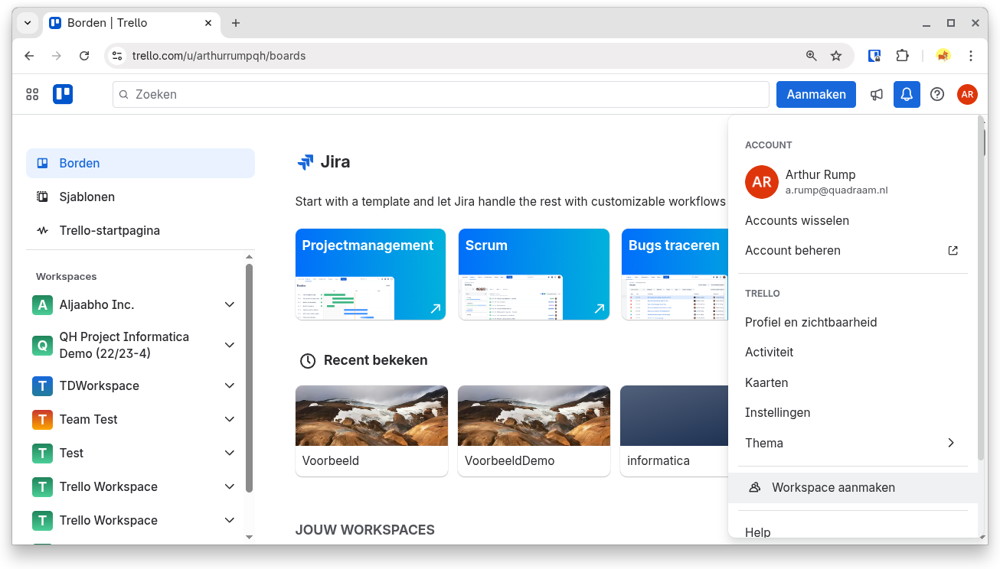

   Gebruik de naam van je team als naam voor de workspace, kies een workspacetype (bijvoorbeeld Engineering/IT) en vul bij de beschrijving *Project Informatica {{ versie }}* in:

   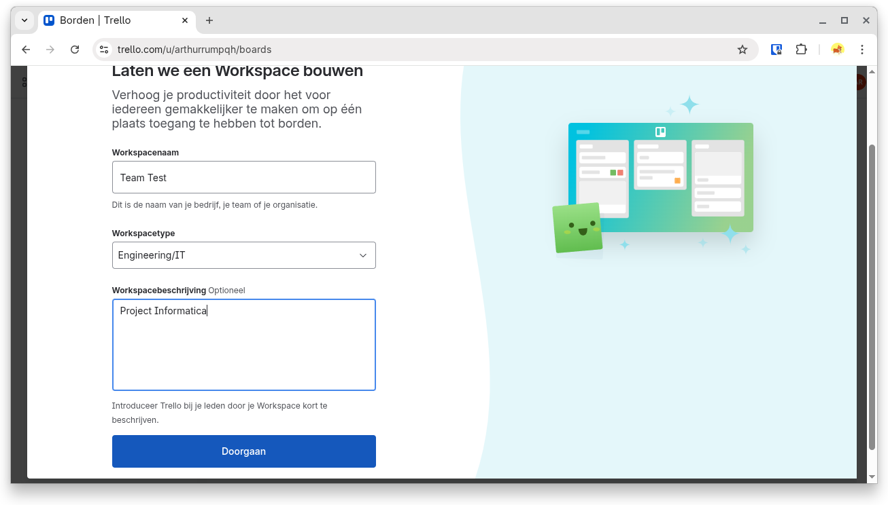

2. Klik op de knop *Uitnodigen met een link*. Stuur de link in jullie Teamskanaal zodat je groepsgenoten (en de docenten!) lid kunnen worden van jullie workspace.

   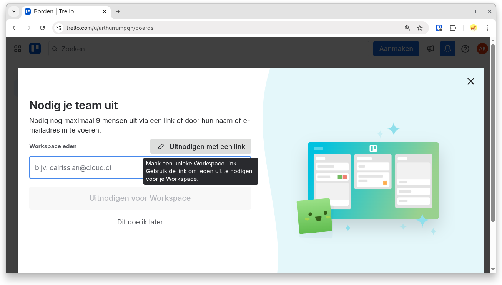

   Klik daarna op *Dit doe ik later* om door te gaan.

   ---

   Als je al een workspace hebt en de uitnodigingslink terug wilt vinden, dan kun je die vinden op de pagina *Leden* in jouw workspace:

   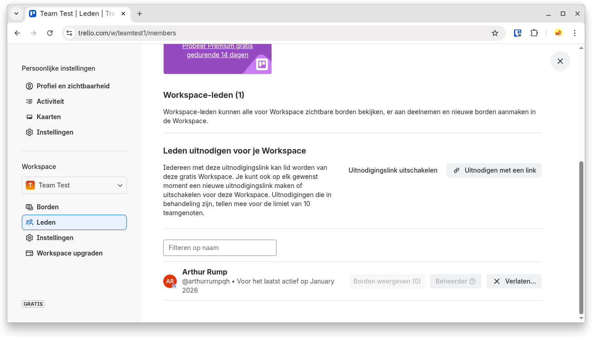

3. Maak een nieuw bord aan in de je nieuwe workspace. Gebruik jullie teamnaam als naam voor het bord en laat de zichtbaarheid staan op *Workspace*:

   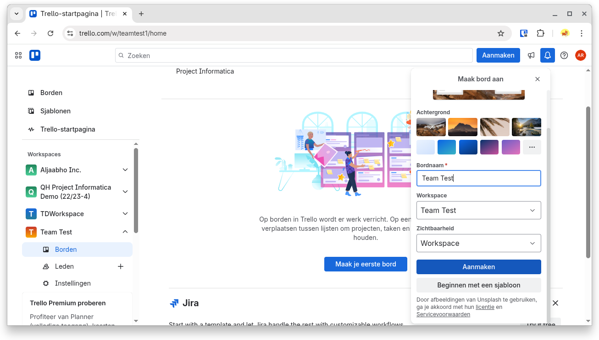

4. Klik op *Lijst toevoegen* en maak minimaal de kolommen *Todo*, *Doing* en *Done* aan:

   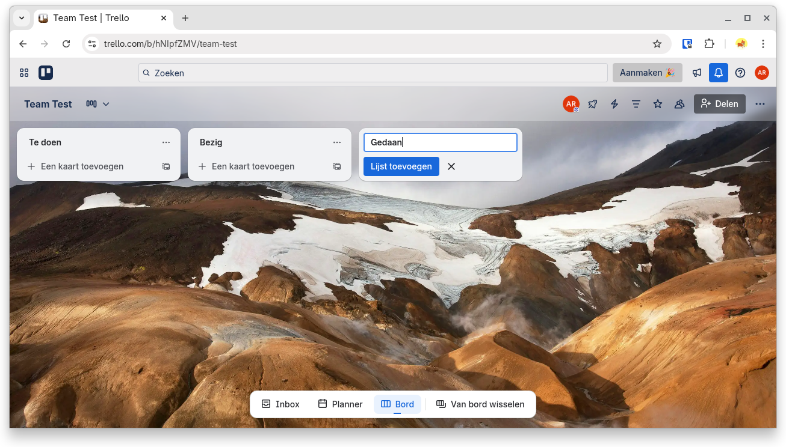

(trello-deelnemen)=
### Bijlage: Deelnemen aan een Trello bord

1. Open de link die jouw scrum master in Teams gedeeld heeft en log in op Trello. Accepteer de uitnodiging om deel te nemen aan de workspace.

2. Open het bord dat jouw scrum master heeft aangemaakt in de workspace.

3. Klik op de knop *Deelnemen aan bord* rechtsbovenin het scherm:

   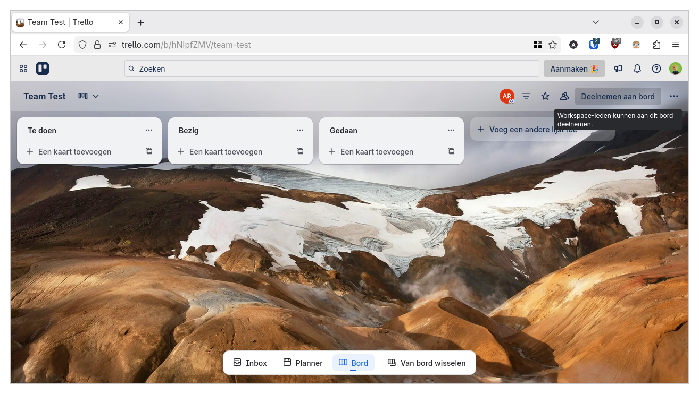

   Dit zorgt ervoor dat jij ook aan taken toegewezen kunt worden.

(github-aanmaken)=
### Bijlage: Een GitHub Classroom team aanmaken

1. Open GitHub Classroom via deze link: {{ github_classroom_url }}

2. Kies jouw naam als je daar om gevraagd wordt:

   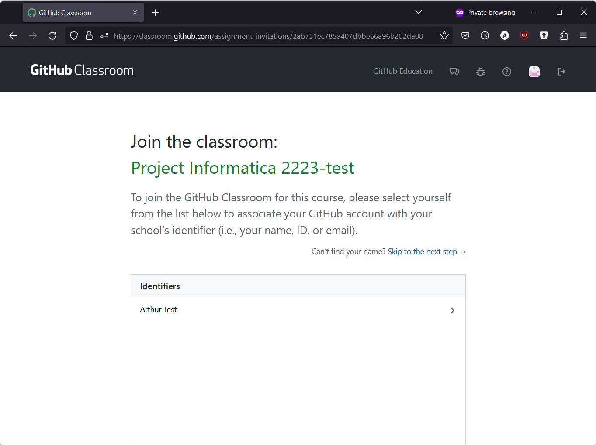

3. Maak een nieuw team aan met jullie teamnaam:

   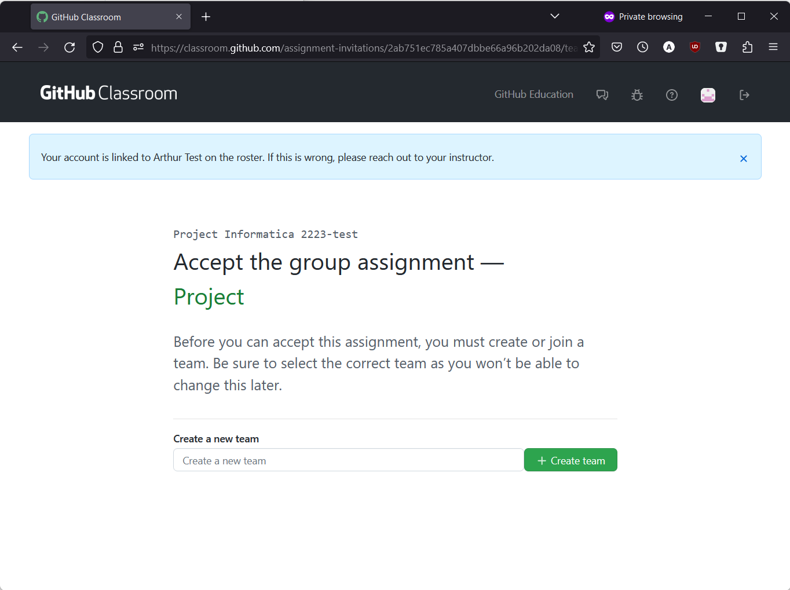

4. Accepteer de opdracht:

   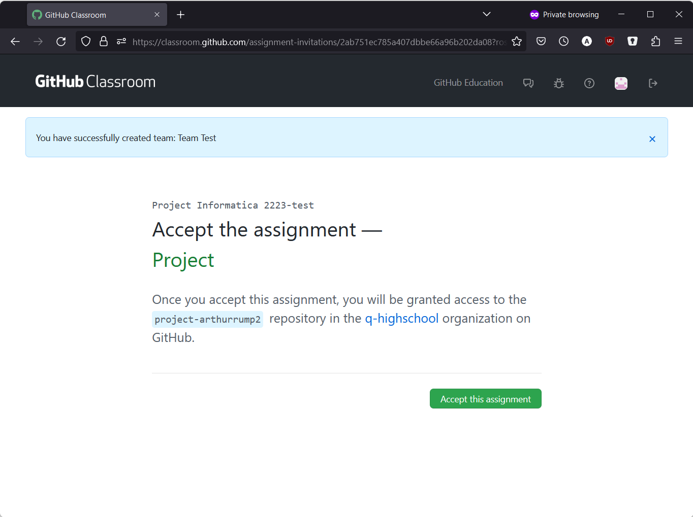

   Dan krijg je deze pagina te zien:

   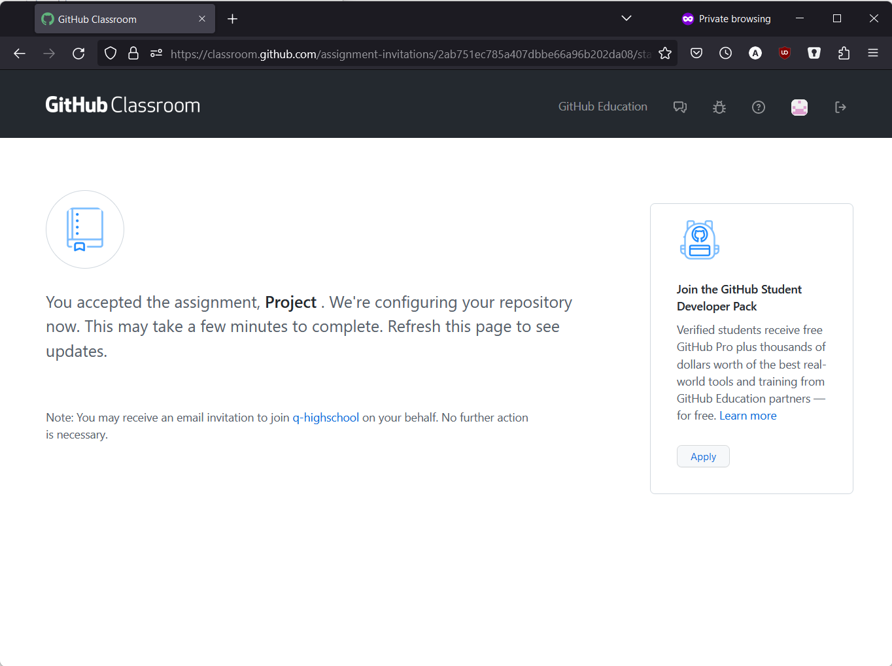

5. Ververs de pagina na enkele ogenblikken:

   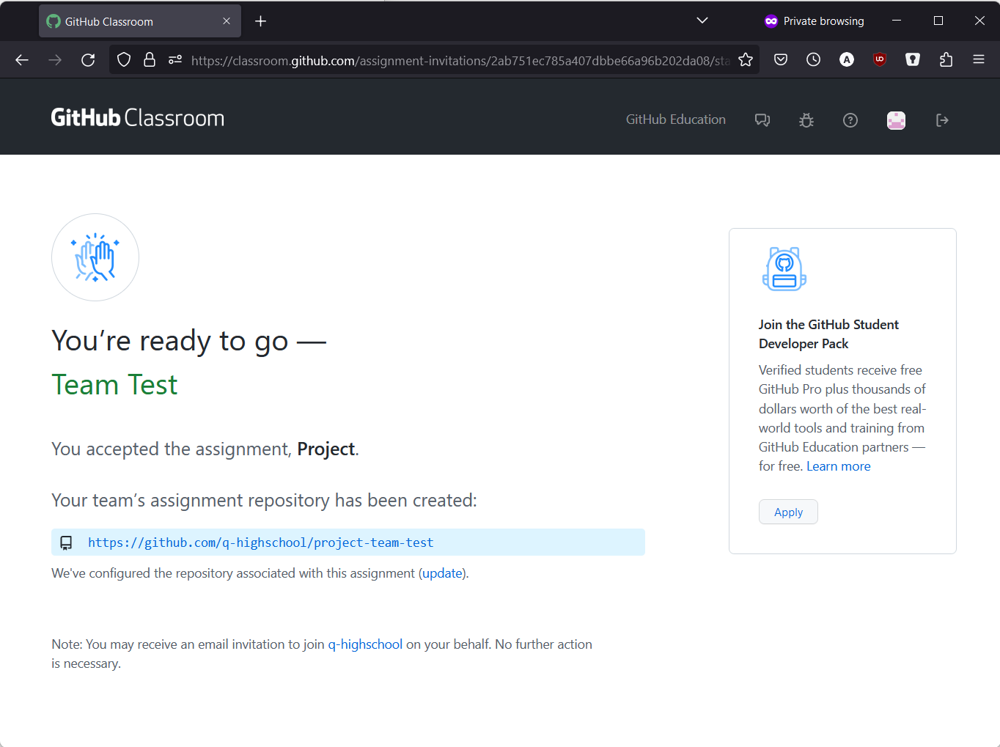

6. Klik op de link om naar de pagina van jullie GitHub repository te gaan. Voortaan kun je deze gewoon vinden door in te loggen op [github.com](https://github.com), dan staat het gewoon bij jouw repositories.

   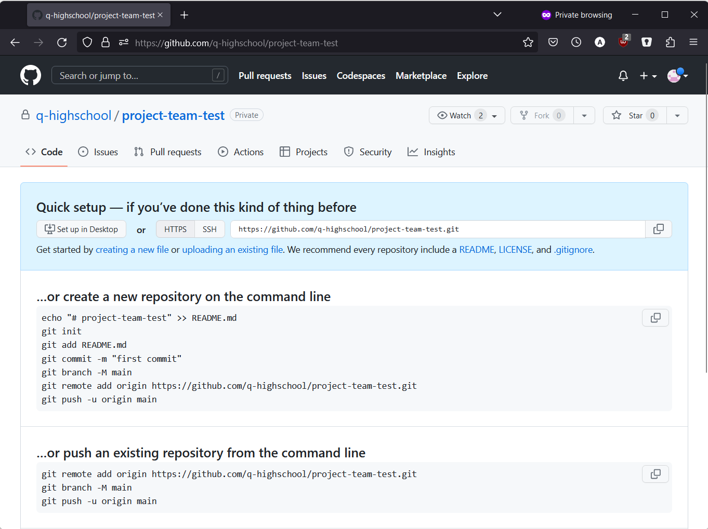

7. Klik op de knop *Set up in Desktop* om jouw repository te openen met GitHub Desktop.

(github-deelnemen)=
### Bijlage: Deelnemen aan een GitHub Classroom team

1. Open GitHub Classroom via deze link: {{ github_classroom_url }}

2. Kies jouw naam als je daar om gevraagd wordt:

   

3. Kies het team dat jullie scrum master al heeft aangemaakt:

   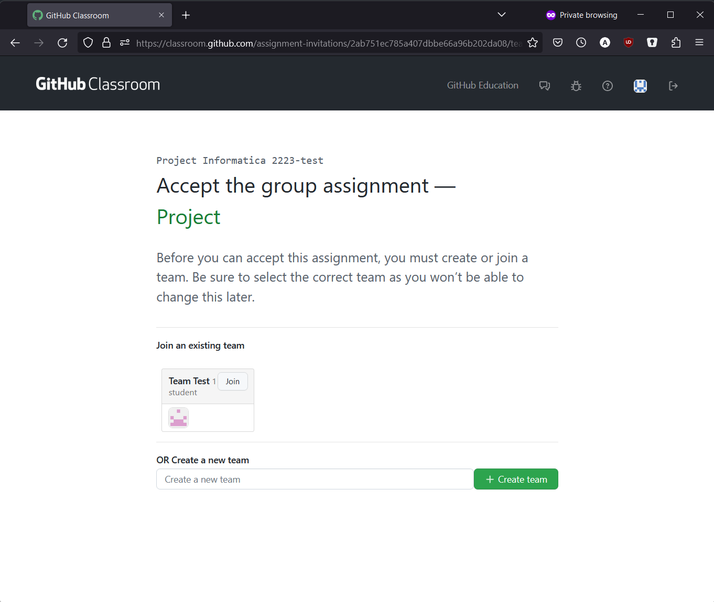

   Klik op de knop *Join* bij het juiste team om daar lid van te worden. Als jullie team er nog niet bij staat, ververs dan de pagina nadat de Scrum master het team heeft aangemaakt.

6. Klik op de link om naar de pagina van jullie GitHub repository te gaan. Voortaan kun je deze gewoon vinden door in te loggen op [github.com](https://github.com), dan staat het gewoon bij jouw repositories.

   

7. Klik op de knop *Set up in Desktop* om jouw repository te openen met GitHub Desktop.
