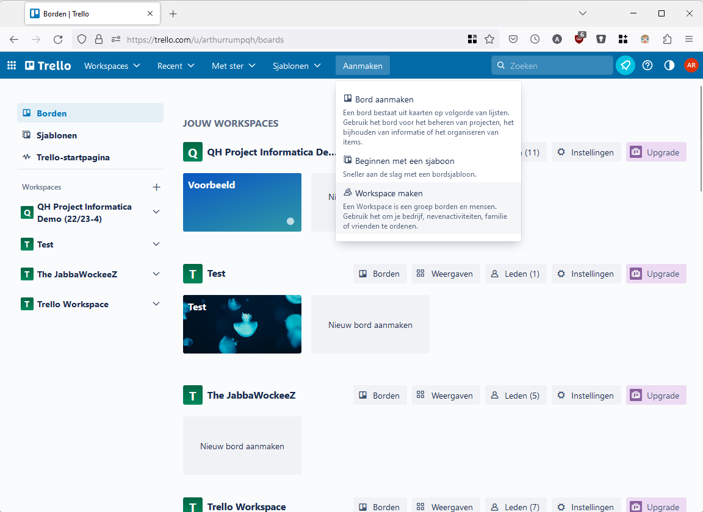
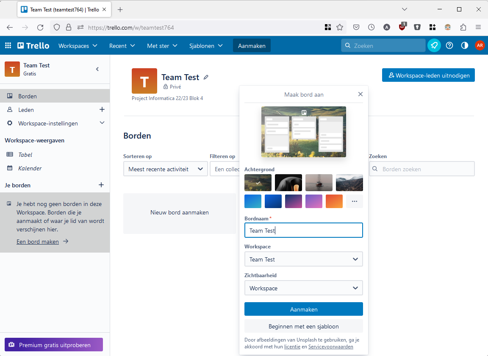
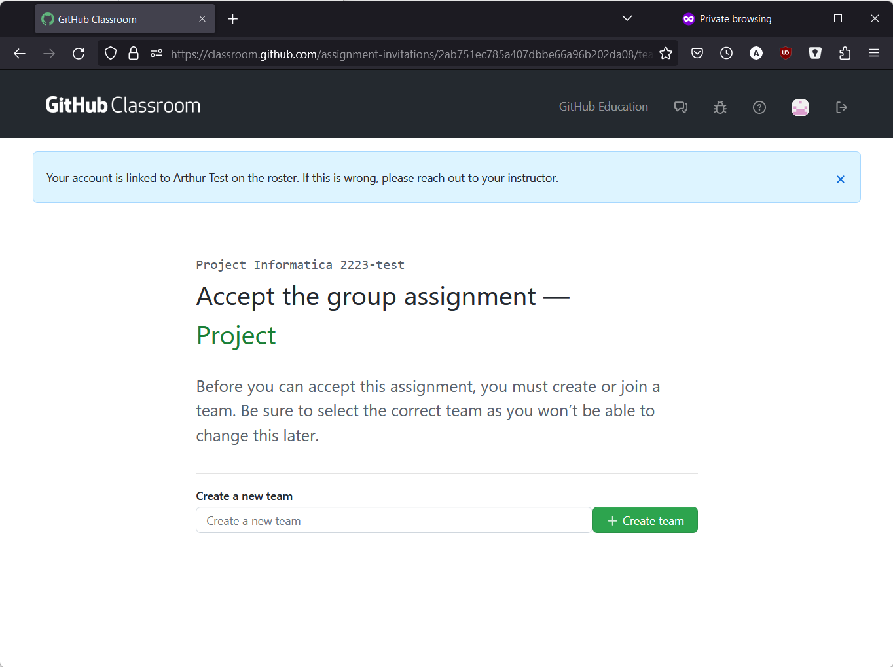

# Startopdracht

1. Neem minstens 10 minuten de tijd om kennis te maken.

   Leer elkaar kennen, probeer om het de komende 10 minuten nog niet over het project te hebben. Welke andere modules hebben jullie al gedaan? Welke ervaring breng je mee? Zijn er gedeelde hobbies of interesses?

2. Verzin een naam voor je team. Geef de naam en de teamleden door aan de docent.

3. Maak werkafspraken:

   - Wanneer werken jullie samen?
   - Hoe wordt er gecommuniceerd?
   - Wat wil je bereiken?
   - Wat doe je als je een taak niet op de afgesproken tijd af kunt krijgen?
   - ...

   Schrijf deze afspraken op, zodat de scrum master jullie eraan kan houden.

   Zorg ook dat iedereen meldingen in Teams heeft ingeschakeld voor jullie Teams kanaal (nadat jullie daar aan toegevoegd zijn, uiteraard):

   

4. Brainstorm samen over de richting van het product. Wat gaan jullie maken?

5. Opdrachten voor de verschillende rollen. Zorg dat al deze taken uiterlijk vrijdag vervuld zijn, zodat je goed van start kunt!

   - Scrum master: 

     - maak een Trello bord aan (een ander backlog mag ook, maar we adviseren Trello). Zie de bijlage voor de juiste instellingen. Deel de *uitnodigingslink* naar je Trello in jullie Teamskanaal. Maak de basiskolommen aan op het Trellobord.
     - maak een team aan in GitHub classroom voor jullie team, en zorg dat je teamgenoten daar ook lid van worden. Zie de bijlage voor de juiste instellingen.

   - Product owner:

     - lees deze pagina over de productvisie: <https://agilescrumgroup.nl/productvisie/>
     - werk de productvisie uit zoals beschreven op de link hierboven. De punten over geld hoef je niet te noemen, maar de eerste vijf zijn wel belangrijk. Punt 6 en 8 zijn ook leuk, als je daar over na wilt denken.
     - schrijf minstens 4 user stories.

     Zet de productvisie en user stories in jouw map in jullie Teamskanaal (kijk bij *Bestanden > 2 Product Owner*) en laat je team weten wanneer je dit gedaan hebt, zodat zij er ook naar kunnen kijken.

   - Developers:

     - begin met het uitwerken van de eerste taken die gedaan moeten worden voor het project. Zorg dat dit goede taken zijn! Als de scrum master de Trello gemaakt heeft, zet dan de taken daarin. Maak samen met de scrum master een eerste taakverdeling (de product owner legt de focus nu op de productvisie, maar kan later ook aan het product werken!).
     - bepaal welke technologie jullie gaan gebruiken om het product te realiseren. Welke game engine ga je gebruiken voor een game (tip: Unity, Godot en GDevelop zijn over het algemeen populair, maar bedenk ook of je wel de tijd wilt nemen om een nieuwe engine te leren)? Ga je een app schrijven in Android Studio, of wordt het App Inventor? Of een iOS app? Welke database ga je gebruiken, en hoe kun je die installeren? Ga je Python gebruiken om je programma in te bouwen, of wordt het deze keer JavaScript of Processing (of nog iets anders)?

## Bijlage: Een Trello workspace en bord aanmaken

1. Maak een workspace aan voor jullie team:

   

   Gebruik de naam van je team als naam voor de workspace, kies een workspacetype (bijvoorbeeld Engineering/IT) en vul bij de beschrijving *Project Informatica 22/23 Blok 4* in:

   

2. Klik op de knop *Uitnodigen met een link* en stuur de link die gekopieerd wordt in jullie Teamskanaal:

   

   Klik daarna op *Dit doe ik later* om door te gaan.

   ---

   Als je al een workspace hebt en de uitnodigingslink terug wilt vinden, dan kun je die vinden via de grote blauwe knop *Workspace-leden uitnodigen* en dan te klikken op *Link kopiëren*:

   

3. Maak een nieuw bord aan in de je nieuwe workspace. Gebruik jullie teamnaam als naam voor het bord en laat de zichtbaarheid staan op *Workspace*:

   

4. Klik op *Lijst toevoegen* en maak minimaal de kolommen *Todo*, *Doing* en *Done* aan:

   

## Bijlage: Deelnemen aan een Trello bord

1. Open de link die jouw scrum master in Teams gedeeld heeft en log in op Trello. Accepteer de uitnodiging om deel te nemen aan de workspace.

2. Open het bord dat jouw scrum master heeft aangemaakt in de workspace.

3. Klik op de knop *Deelnemen aan bord*:

   

   Dit zorgt ervoor dat jij ook aan taken toegewezen kunt worden.

## Bijlage: Een GitHub Classroom team aanmaken

1. Open GitHub Classroom via deze link: {{ github_classroom_url }}

2. Kies jouw naam als je daar om gevraagd wordt:

   

3. Maak een nieuw team aan met jullie teamnaam:

   

4. Accepteer de opdracht:

   

   Dan krijg je deze pagina te zien:

   

5. Ververs de pagina na enkele ogenblikken:

   

6. Klik op de link om naar de pagina van jullie GitHub repository te gaan. Voortaan kun je deze gewoon vinden door in te loggen op [github.com](https://github.com), dan staat het gewoon bij jouw repositories.

   

7. Klik op de knop *Set up in Desktop* om jouw repository te openen met GitHub Desktop.

## Bijlage: Deelnemen aan een GitHub Classroom team

Volg de stappen uit de vorige bijlage over het maken van een GitHub Classroom team. Bij stap 3 maak je niet een nieuw team aan, maar kies je het team dat jullie scrum master al heeft aangemaakt:

Klik op de knop *Join* bij het juiste team om daar lid van te worden. Als jullie team er nog niet bij staat, ververs dan de pagina nadat de Scrum master het team heeft aangemaakt.