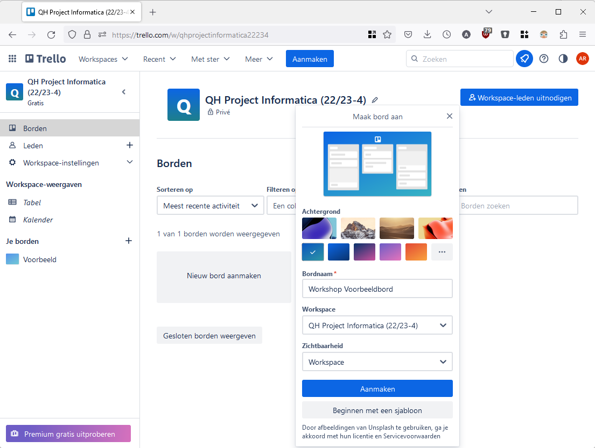
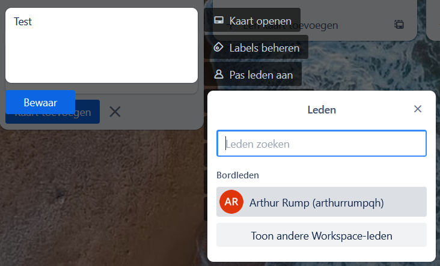
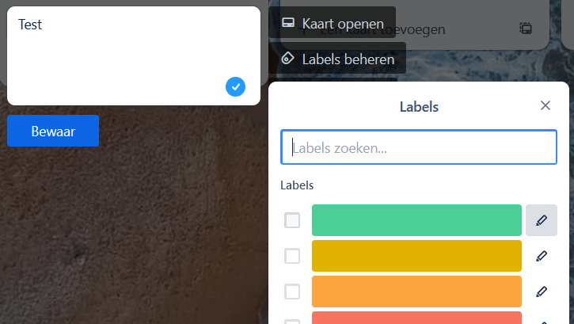
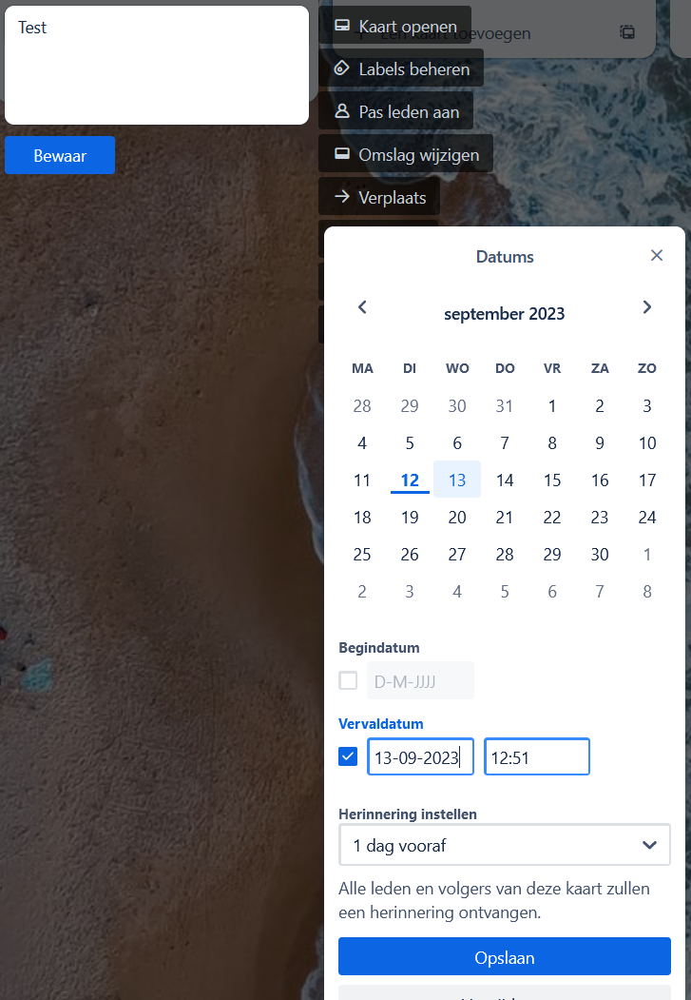

# Aan de slag met Trello

Werk in groepen van 3-4 personen (dit is niet je uiteindelijke projectgroep).

## Voorbereiding

Eén persoon uit de groep volgt de volgende stappen om een bord aan te maken:

1. Maak een nieuw bord aan in Trello via de knop *Aanmaken*. Geef het bord een naam en zet het in je eigen standaard workspace:

   

2. Deel het bord via de knop *Delen* rechtsboven met jouw groepsgenoten.

3. Maak kolommen aan voor Todo, Doing en Done.

De andere personen uit de groep openen het bord nadat ze zijn uitgenodigd.

## Taken bedenken

1. Lees de volgende casus:

   > Een automatisch sprinklersysteem voor je tuin. Als de bloemperken te droog worden, dan zou het fijn zijn dat de sprinklers vanzelf aan gaan. Natuurlijk moeten we wel een beetje op de centen letten, dus de eigenaar wil een limiet kunnen instellen op de hoeveelheid water die verbruikt wordt via hun telefoon. Als er de volgende dag regen komt, hoeven de sprinklers natuurlijk ook niet aan. Idealiter zou het systeem ook integreren met gegevens van het waterbedrijf en het waterschap, zodat er geen gebrek aan drink- of grondwater ontstaat.
   > 
   > User stories:
   > 
   > - Als tuineigenaar wil ik dat mijn planten bewaterd worden, zodat ze niet verdrogen.
   > - Als tuineigenaar wil ik niet te veel water gebruiken, zodat ik niet te veel geld kwijt ben aan mijn waterrekening.
   > - Als tuineigenaar wil ik instellingen en statistieken kunnen aanpassen en inzien op mijn telefoon, zodat ik de controle houdt over het systeem.
   > - Als waterbedrijf willen wij niet dat mensen te veel water gebruiken bij schaarste, zodat we een goede drinkwatervoorziening kunnen garanderen.
   > - Als waterschap willen wij niet dat mensen de sloten leegpompen, zodat we voldoende water overhouden voor de landbouw.

   <!--
   > Een website met een database voor het bijhouden van cijfers voor de informaticamodules. Leerlingen kunnen hun cijfers zien en krijgen een mailtje als er een nieuw cijfer op staat. Docenten kunnen cijfers op de website invoeren of een Excel bestand met alle cijfers uploaden om dat automatisch te doen. Alle gebruikers kunnen inloggen via hun schoolaccount, waarmee we automatisch weten of ze leerling of docent zijn en welke modules ze volgen of geven.
   >
   > User stories:
   >
   > - Als docent wil ik cijfers invoeren, zodat leerlingen hun cijfers kunnen zien.
   > - Als docent wil ik een Excel bestand met cijfers kunnen uploaden, zodat ik niet handmatig alle cijfers hoef over te typen.
   > - Als leerling wil ik mijn cijfers overzichtelijk kunnen bekijken, zodat ik weet hoe ik ervoor sta.
   > - Als leerling wil ik een mailtje krijgen als er een nieuw cijfer is, zodat ik niet constant de website hoef te checken.
   -->

2. Bedenk met je groep welke taken gedaan moeten worden om dit project te realiseren. Denk eraan dat je goede taken bedenkt! Dus:
   - Een afgebakend onderdeel van het product
   - Door één persoon met wat voorkennis binnen enkele uren uit te voeren
3. Zet deze taken in de Todo kolom van je Trello bord
4. Gebruik de *Pas leden aan* knop om de taken te verdelen:

   

5. Gebruik labels om de taken een prioriteit te geven. Met het potloodje naast elk label kun je een beschrijving aan elke kleur geven.

   

6. Gebruik de knop *Datums* om aan een paar taken een deadline, in Trello een *Vervaldatum* toe te kennen:

   